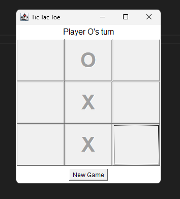

# Tic-Tac-Toe (Java AWT)

A simple graphical Tic-Tac-Toe game implemented in Java using AWT and the MVC pattern.

## Features

*   Classic 3x3 gameplay for two players (X and O).
*   Graphical interface using AWT.
*   Status updates (current turn, win/tie messages).
*   "New Game" button to restart.
*   Win and tie detection.

## Prerequisites

*   Java Development Kit (JDK) 8 or later installed.

## How to Run

1.  **Save Files:** Place `Main.java`, `GameModel.java`, `GameView.java`, and `GameController.java` in the same directory.
2.  **Open Terminal:** Navigate to that directory using `cd`.
3.  **Compile:**
    ```bash
    javac Main.java
    ```
4.  **Run:**
    ```bash
    java Main
    ```
5.  **Play:** The game window will appear. Click squares to play, X goes first.

## Screenshot of the Game



